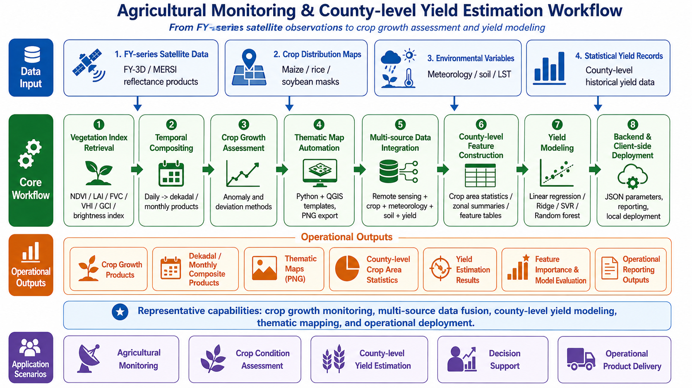

Remote Sensing-based Agricultural Monitoring and Yield Modeling

::: {.workflow-figure-card}

Generic workflow diagram for agricultural monitoring and county-level yield estimation, from FY-series observations to crop growth assessment and yield modeling.

:::

This page summarizes my professional experience in developing **crop growth assessment** and **county-level crop yield estimation** workflows for integrated agricultural monitoring. The representative project behind this page focused on agricultural monitoring over **Heilongjiang Province**, one of the most important agricultural regions in China.

My work in this project covered both **remote sensing product generation** and **yield estimation model development**, including FY-series satellite data processing, vegetation index retrieval, crop growth evaluation, multi-source data integration, machine-learning model exploration, thematic map automation, and backend/client-side algorithm adaptation.

This project represents one of my most important professional experiences in agricultural remote sensing, because it connected satellite-based crop monitoring, statistical modeling, operational deployment, and deployment-side product delivery.

Due to confidentiality requirements, detailed code, non-public datasets, private implementation details, non-public operational information, and operational product examples are not publicly displayed. The content below summarizes generalized technical workflows and my personal contributions.

---

## Project Overview

The project aimed to support an integrated agricultural monitoring system by developing operational algorithms for:

* **Crop growth assessment**
* **Crop condition monitoring**
* **Vegetation index product generation**
* **County-level crop yield estimation**
* **Thematic map production**
* **Backend and client-side algorithm deployment**

The crop growth assessment module was mainly based on **FY-series satellite data**, especially **FY-3D/MERSI** products. The monitoring period focused on the crop growing season from **May to October**, with products generated at **daily**, **dekadal**, and **monthly** time scales.

The crop yield estimation module focused on building a county-level workflow for major crops such as:

* **Maize**
* **Rice**
* **Soybean**

The workflow integrated remote sensing indices, meteorological variables, soil-related variables, crop distribution data, county boundaries, and historical statistical yield records.

---

## My Role

I worked as a **core algorithm developer and remote sensing engineer** for the crop growth assessment and crop yield estimation modules.

My responsibilities included:

* Designing crop growth assessment algorithms
* Developing FY-series satellite-based vegetation index workflows
* Implementing daily, dekadal, and monthly product-generation algorithms
* Developing anomaly and deviation-based crop growth evaluation methods
* Building thematic map automation workflows
* Collecting and preprocessing multi-source data for yield estimation
* Exploring crop yield estimation models
* Conducting feature importance and multicollinearity analysis
* Adapting algorithms for backend and client-side deployment
* Writing technical documentation and algorithm descriptions

My role covered the full workflow from data preparation and algorithm development to model exploration, technical documentation, and operational adaptation.

---

## Data and Scale

The project involved multi-source agricultural monitoring data.

### Remote Sensing Data

The crop growth assessment module mainly used **FY-series satellite data**, especially FY-3D/MERSI products, to generate vegetation and crop condition indicators during the growing season.

Remote sensing products included:

* NDVI
* LAI
* FVC
* VHI
* GCI
* Brightness-related index products

### Temporal Scale

The monitoring workflow supported:

* **Daily products**
* **Dekadal products**
* **Monthly products**

The main crop growing season was from **May to October**.

### Spatial Scale

The project focused on **Heilongjiang Province**, with outputs designed for:

* Province-level monitoring
* County-level crop statistics
* Regional crop growth assessment
* County-level yield estimation

### Yield Estimation Data

The yield estimation workflow integrated:

* Remote sensing vegetation indices
* Meteorological variables
* Soil-related variables
* Land surface temperature variables
* Crop distribution maps
* County boundaries
* Historical statistical yield records
* Crop area statistics

Historical modeling data covered multiple years, including the period from **2014 to 2023** in the data preparation and model exploration stage.

---

## Technical Workflow

### 1. FY-series Crop Growth Product Generation

The crop growth assessment workflow was designed to generate routine agricultural remote sensing products from FY-series satellite data.

The workflow included:

* Reading FY-series satellite reflectance products
* Extracting required spectral bands
* Applying cloud or quality filtering where applicable
* Generating vegetation and crop condition indicators
* Applying agricultural masks or crop-related spatial constraints
* Reprojecting and clipping raster outputs
* Producing standardized raster products
* Organizing products by time scale and product type

### Outputs

* Daily agricultural index products
* Dekadal composite products
* Monthly composite products
* Standardized raster outputs for crop monitoring

### Skills Demonstrated

::: {.tech-tags}
FY-series
FY-3D
MERSI
Crop Growth Monitoring
Raster Processing
Python
GDAL
rasterio
:::

---

### 2. Vegetation and Crop Condition Indices

The crop growth module included multiple remote sensing indicators for monitoring vegetation status and crop condition.

### NDVI

NDVI was used as the core vegetation index for crop greenness and growth monitoring.

### LAI

LAI was derived from vegetation index information to represent canopy structure and crop leaf area development.

### FVC

FVC was used to describe vegetation coverage and crop canopy density.

### VHI

VHI was used to represent vegetation health by integrating vegetation condition and thermal-related information.

### GCI

GCI was used as a greenness-related indicator for crop growth status.

### Brightness Index

Brightness-related indices were generated to support crop surface condition monitoring and product interpretation.

### Outputs

* NDVI products
* LAI products
* FVC products
* VHI products
* GCI products
* Brightness-related products
* Daily, dekadal, and monthly composites

### Skills Demonstrated

::: {.tech-tags}
NDVI
LAI
FVC
VHI
GCI
Brightness Index
Vegetation Monitoring
:::

---

### 3. Crop Growth Assessment

The crop growth assessment workflow used both **anomaly-based** and **deviation-based** methods.

### Anomaly-based Assessment

The anomaly method compared current vegetation conditions with historical or multi-year reference conditions to identify whether crop growth was better or worse than normal.

### Deviation-based Assessment

The deviation method compared current vegetation conditions with a reference period, such as the previous year or a selected baseline period, to evaluate crop growth changes.

### Growth Classification

The crop growth products were classified into different condition levels, supporting regional interpretation and map visualization.

The workflow supported:

* Current-period crop growth assessment
* Historical reference comparison
* Previous-period or previous-year comparison
* Regional crop condition interpretation
* Map-ready classified products

### Outputs

* Crop growth anomaly products
* Crop growth deviation products
* Classified crop condition maps
* Growth assessment statistics
* Thematic map inputs

### Skills Demonstrated

::: {.tech-tags}
Crop Growth Assessment
Anomaly Method
Deviation Method
Temporal Comparison
Classification
:::

---

### 4. Thematic Map Automation

The project included automated thematic map generation for crop growth and agricultural monitoring products.

The workflow involved:

* Loading QGIS project templates
* Replacing raster layers dynamically
* Replacing vector boundary layers
* Updating map titles
* Updating time labels
* Updating product names
* Exporting PNG thematic maps
* Adapting outputs for backend and client-side display

This helped transform raster products into map products suitable for operational visualization and reporting.

### Outputs

* Crop growth thematic maps
* Agricultural index maps
* County-level monitoring maps
* PNG map products

### Skills Demonstrated

::: {.tech-tags}
QGIS Python API
Thematic Mapping
Map Automation
Raster Layer Replacement
Vector Boundary Replacement
PNG Export
:::

---

### 5. County-level Crop Yield Estimation Workflow

The crop yield estimation module was developed from data preparation to model exploration and operational workflow design.

The workflow included:

* Collecting historical crop yield records
* Preparing county-level statistical data
* Processing remote sensing vegetation indicators
* Preparing meteorological and soil-related variables
* Extracting crop-specific information using crop distribution maps
* Calculating county-level crop area statistics
* Matching remote sensing and environmental variables with yield records
* Exploring yield estimation models
* Building model-ready tabular datasets
* Generating county-level yield estimation outputs

The final workflow focused on estimating:

* County-level crop yield
* Crop planting area
* Total crop production

for major crops such as **maize**, **rice**, and **soybean**.

### Skills Demonstrated

::: {.tech-tags}
County-level Yield Estimation
Crop Area Statistics
Remote Sensing Indices
Meteorological Variables
Soil Variables
Statistical Yield Records
:::

---

### 6. Multi-source Data Integration

Yield estimation required integration of multiple data sources.

Candidate variables included:

* Precipitation
* Land surface temperature
* Maximum temperature
* Minimum temperature
* NDVI
* LAI
* Soil moisture
* Vegetation health indicators
* Crop distribution information
* Historical yield records
* County-level administrative units

The data preparation workflow involved:

* NetCDF-to-raster conversion where needed
* Raster compositing
* Zonal statistics
* Variable aggregation
* County-level table construction
* Data quality checking
* Feature table generation for modeling

This part of the project strengthened my ability to connect remote sensing products, environmental variables, crop distribution data, and statistical records into a unified modeling dataset.

### Skills Demonstrated

::: {.tech-tags}
Multi-source Data Fusion
Zonal Statistics
Feature Engineering
County-level Dataset
Data Quality Control
:::

---

### 7. Yield Modeling and Model Exploration

During the yield estimation module, I explored several statistical and machine-learning approaches.

Modeling approaches included:

* Multiple linear regression
* Polynomial regression
* Polynomial Ridge regression
* Support vector regression
* Random forest
* Sensitivity analysis
* Feature importance analysis

Model interpretation and diagnostic analysis included:

* Correlation heatmaps
* Feature importance analysis
* Permutation importance
* VIF-based multicollinearity analysis
* Model evaluation metrics
* Sensitivity testing

The project also involved learning and evaluating the feasibility of the **WOFOST crop growth model**. However, because WOFOST requires many crop physiological parameters and detailed environmental inputs, and because operational data availability was limited, it was not selected as the final operational solution. Instead, a more deployable remote-sensing and statistical or machine-learning-based workflow was adopted.

### Outputs

* Model-ready feature tables
* Regression and machine-learning model results
* Feature importance outputs
* Correlation analysis outputs
* Multicollinearity analysis results
* County-level yield estimation workflow
* Technical documentation

### Skills Demonstrated

::: {.tech-tags}
Random Forest
Support Vector Regression
Ridge Regression
Polynomial Regression
Feature Importance
VIF
Model Evaluation
WOFOST Feasibility Assessment
:::

---

### 8. Backend and Client-side Algorithm Adaptation

The project required algorithms to run in both backend and client-side environments.

### Backend Adaptation

Backend algorithms focused on:

* Platform scheduling
* JSON-based task parameters
* Batch processing
* Product directory organization
* System integration support
* Result reporting
* Operational execution

### Client-side Adaptation

Client-side algorithms focused on:

* Deployment-side preparation
* Local runtime environment
* Product display
* Thematic map output
* Client-facing operational workflow adaptation

The core computational logic was shared where possible, while input parameters, file organization, reporting format, and runtime configuration were adapted for different deployment scenarios.

### Skills Demonstrated

::: {.tech-tags}
Backend Deployment
Client-side Deployment
JSON Parameters
Batch Workflow
Local Deployment
Operational Adaptation
:::

---

## Main Outputs

The project supported the generation of multiple agricultural monitoring and yield-related outputs:

::: {.output-grid}

FY-series NDVI products

LAI products

FVC products

VHI products

GCI products

Brightness-related products

Daily agricultural monitoring products

Dekadal composite products

Monthly composite products

Crop growth anomaly products

Crop growth deviation products

Crop growth thematic maps

County-level crop area statistics

County-level yield estimation results

Total production estimation results

Model evaluation outputs

Feature importance analysis outputs

Technical documentation and workflow descriptions

---

:::
## Skills Demonstrated

### Agricultural Remote Sensing

* Crop growth monitoring
* Vegetation index retrieval
* Crop condition assessment
* Growing-season monitoring
* County-level agricultural analysis
* Crop distribution masking

### Geospatial Processing

* Raster preprocessing
* Regional clipping
* Zonal statistics
* Crop area calculation
* Spatial masking
* Thematic mapping
* Product organization

### Modeling and Data Science

* Multi-source feature construction
* Regression modeling
* Random forest modeling
* Support vector regression
* Feature importance analysis
* Multicollinearity analysis
* Yield estimation workflow design

### Operational Engineering

* Python batch processing
* Backend and client-side adaptation
* JSON task parameters
* Deployment-side preparation
* QGIS-based map automation
* Technical documentation
* Workflow standardization

---

## Professional Growth

This project was a major step in my professional development because it required me to move beyond routine remote sensing product generation and engage with the full complexity of agricultural monitoring and yield estimation.

The main challenges included:

* Limited availability of key crop model parameters
* Frequent changes in project requirements
* Need for both backend and client-side algorithm adaptation
* Multi-source data inconsistency
* Variable selection and model uncertainty
* Translating agricultural modeling concepts into operational algorithms

Through this project, I gained experience in:

* Building agricultural remote sensing product chains
* Designing county-level yield estimation workflows
* Integrating remote sensing, meteorological, soil, crop distribution, and statistical yield data
* Evaluating different modeling strategies
* Communicating technical trade-offs
* Delivering deployable algorithms under real project constraints

This project strengthened my interest in agricultural remote sensing, environmental data fusion, GeoAI, and interpretable modeling for real-world decision-support systems.

---

## Confidentiality Statement

This project was conducted in an operational and applied operational engineering context. Therefore, detailed source code, non-public datasets, private implementation details and non-public operational information, and operational product examples are not publicly displayed.

The purpose of this page is to summarize generalized technical workflows, model-development logic, and my personal contributions without exposing confidential project materials.
