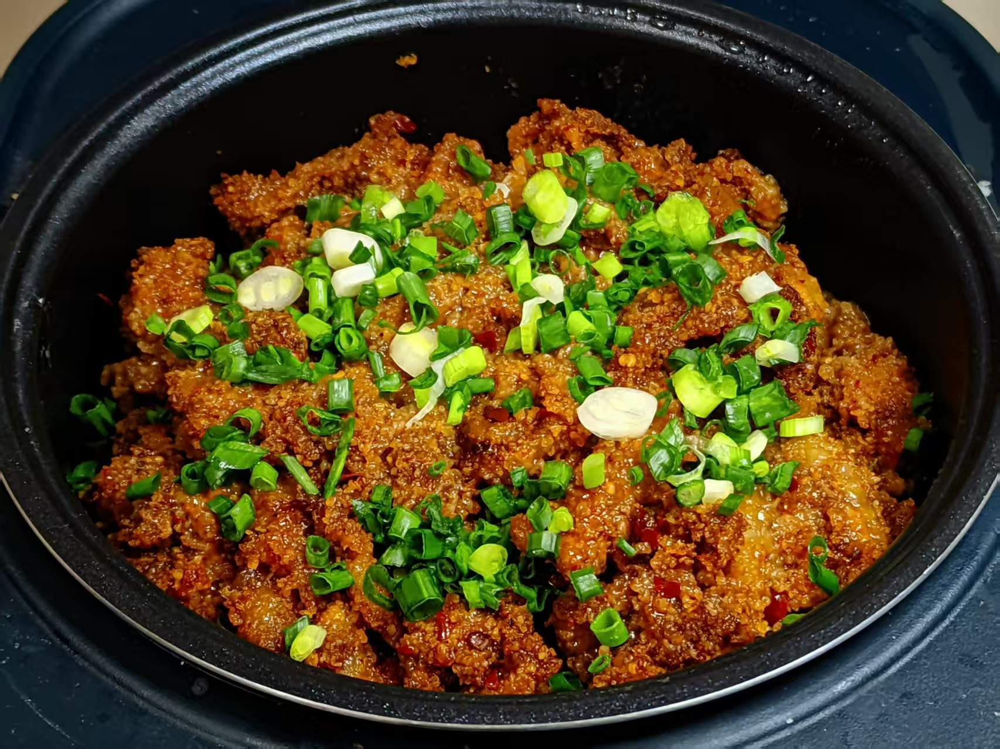
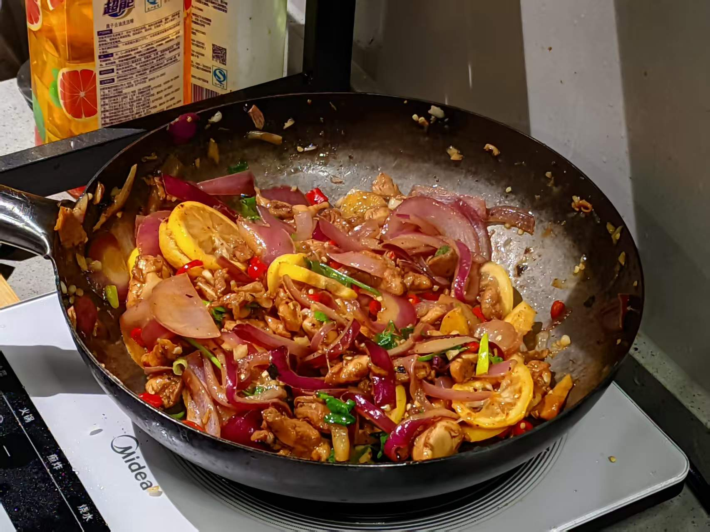
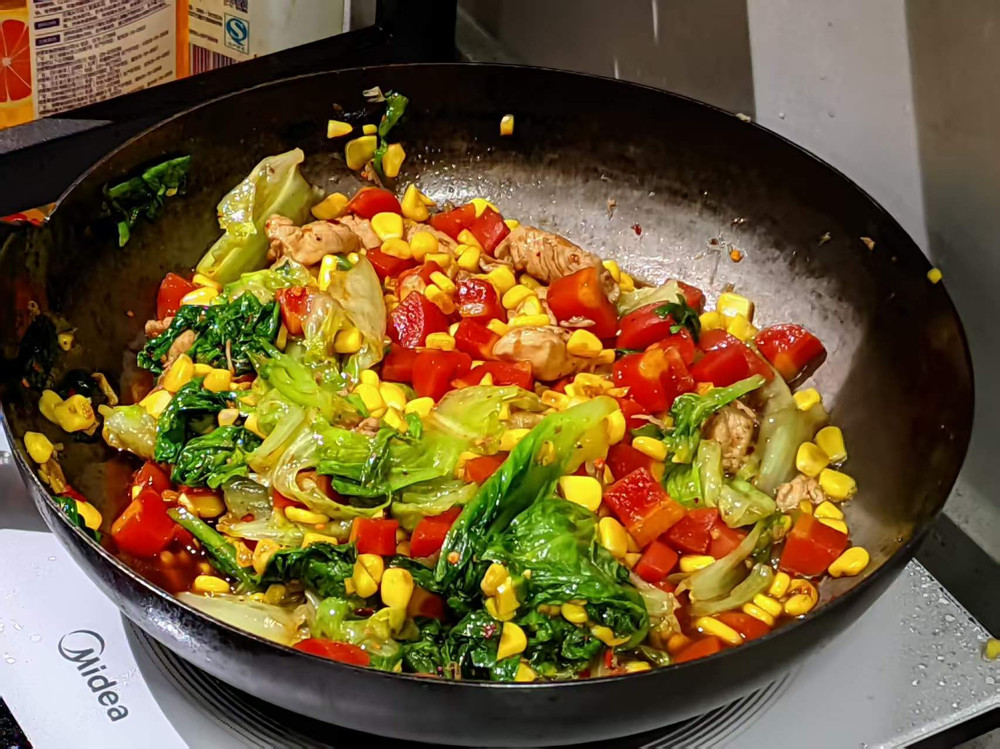
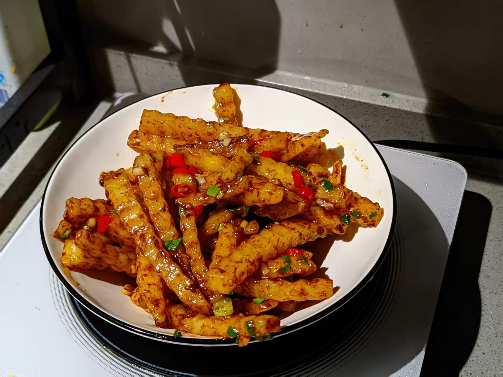
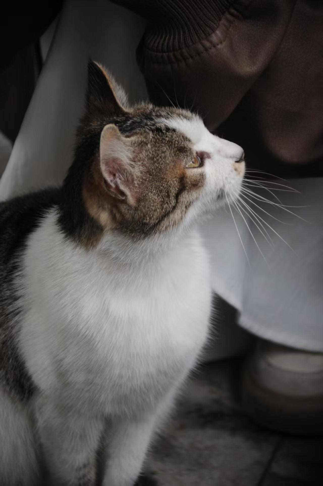

::: {#hero-heading}

I am a Remote Sensing Algorithm Engineer at XINGTUZHIHUI (XI'AN) DIGITAL TECHNOLOGY CO., LTD in Chengdu, China, and a prospective M.S./Ph.D. applicant in GeoAI, AI for Remote Sensing, Ecological Remote Sensing, and Wildfire Risk Modeling. My work connects geospatial machine learning, multi-source satellite data processing, and operational remote sensing product generation. I have research experience in wildfire driving factor modeling, ecological environment assessment, land-use change analysis, and remote sensing scene classification. I am especially interested in using spatial machine learning and explainable AI methods, including XGBoost, SHAP, and GeoShapley, to understand nonlinear and spatially heterogeneous environmental processes. I hope to contribute to research groups working on GeoAI, fire ecology, ecological monitoring, and reliable remote sensing systems for environmental decision support.

## Current Position

Remote Sensing Algorithm Engineer &middot; May 2024 - Present 
XINGTUZHIHUI (XI'AN) DIGITAL TECHNOLOGY CO., LTD 
Chengdu, China &middot; On-site

I develop Python-based remote sensing preprocessing workflows and
operational product-generation pipelines for multi-source satellite
data, with applications in wildfire monitoring, agricultural monitoring,
ecological assessment, and crop-yield estimation.

## Education

B.S. in Geographic Information Science 
Shandong Jiaotong University 
GPA: 89.6 / 100; Ranked 1st of 33 students, Top 3%

## Application Focus

I am seeking M.S. and Ph.D. opportunities in GeoAI, AI for Remote Sensing, Ecological Remote Sensing, and Wildfire Risk Modeling.

## Research Interests

- GeoAI and AI for Remote Sensing
- Wildfire risk modeling and fire ecology
- Multi-source satellite data analysis
- Spatial machine learning and explainable AI
- Ecological environment monitoring
- Operational remote sensing systems

## Academic & Professional Highlights

### Academic Performance

- GPA: 89.6 / 100; Ranked 1st of 33 students, Top 3%.

### Research & Publications

- One manuscript on grassland and forest fire driving factors in Southwest China is under review.
- First-author and co-author publications in IEEE and SPIE conference proceedings.

### Technical Experience

- Experience in multi-source satellite data processing, wildfire monitoring, agricultural monitoring, ecological assessment, and remote sensing product generation.

### Awards & Recognition

- National Encouragement Scholarship x3.
- Comprehensive First-Class Scholarship x3.
- Esri-Cup Chinese College Students GIS Software Development Contest awards x4.
- Remote Sensing Technology Competition First Prize awards x3.

## Research and Experience

My [Featured Research](research/featured-research.qmd) follows a
wildfire-focused trajectory from burned area mapping and post-fire
ecological assessment to spatially explainable fire driver analysis and
wildfire prediction modeling. My [Applied Remote Sensing & AI4RS
Projects](research/applied-remote-sensing-engineering.qmd) summarize my
broader experience in AI for Remote Sensing, satellite data
preprocessing, and operational remote sensing workflows. My
[Experience](experience.qmd) section presents public-safe summaries of
operational engineering practice; internal code, datasets,
implementation details, and operational products are not publicly
displayed.

## Beyond Research

Beyond my academic and engineering work, I enjoy using food and
photography as quieter forms of observation. Cooking helps me slow down
and notice materials, timing, and texture; photography keeps me
attentive to light, place, and small details in everyday field-like
moments.

::: {.showcase-grid}
::: {.showcase-tile}
::: {.showcase-photo-collage}
{.showcase-photo-main}
::: {.showcase-photo-thumbs}

:::
:::

### Food Studio

Homemade dishes, plating experiments, and regional flavors that reflect
my curiosity about craft, texture, and daily
life.
:::

::: {.showcase-tile}
::: {.showcase-photo-collage}
{.showcase-photo-main}
::: {.showcase-photo-thumbs}

:::
:::

### Photography Notes

Landscape, city, campus, and fieldwork moments captured through the same
habit of close observation that also
shapes my remote sensing work.
:::
:::

## News

- **Apr 8, 2026** - Completed repayment of my undergraduate student
  loan, marking an important personal milestone in my academic journey.
- **May 1, 2026** - Started a structured update of my
  [academic portfolio website](index.qmd) to better present my research
  projects, publications, technical experience, and application-oriented
  materials.

## Visitor Map

::: {.visitor-map-card}
::: {.visitor-map-body}
::: {.visitor-map-visual aria-label="MapMyVisitors live visitor map"}

:::

::: {.visitor-map-copy}
### Hello, World!

Thanks for stopping by. Visitors from research institutions,
universities, and geospatial communities around the world are warmly
welcome. If you are interested in collaborating or just want to say hi,
feel free to reach out.

- Chengdu, China
- [youbinhe0607@gmail.com](mailto:youbinhe0607@gmail.com)
- Visitor locations tracked by
  [MapMyVisitors](https://mapmyvisitors.com/web/1c5fy).
:::
:::
:::

::: {.last-updated}
Last updated: June 2026
:::

## Contact

- Email: [youbinhe0607@gmail.com](mailto:youbinhe0607@gmail.com)
- GitHub: <https://github.com/HeYoubin>
- Google Scholar: <https://scholar.google.com/citations?user=-r5foIsAAAAJ&hl=zh-CN>
- ORCID: <https://orcid.org/0009-0004-8018-0909>
- LinkedIn: <https://www.linkedin.com/in/youbin-he-610735308/>

:::
