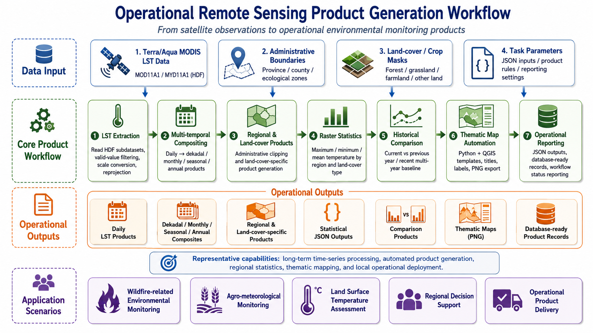

From Satellite Observations to Operational Environmental Monitoring Products

::: {.workflow-figure-card}

Generic workflow diagram for operational remote sensing product generation, from satellite observations to monitoring outputs and reporting.

:::

This page summarizes my professional experience in developing **operational remote sensing product-generation workflows** for wildfire-related environmental monitoring, land surface condition assessment, and agro-meteorological applications.

The representative project behind this page focused on building automated satellite-based monitoring products for regional environmental and disaster-prevention applications. My work involved transforming multi-source satellite data into **routine raster products**, **regional statistics**, **comparison products**, **thematic maps**, **JSON outputs**, and **structured operational results**.

This project represents one of my first large-scale operational remote sensing engineering experiences, where I worked across algorithm development, geospatial processing, thematic mapping, system integration support, technical documentation, and deployment-side preparation.

Due to confidentiality requirements, detailed code, non-public datasets, private implementation details, non-public operational information, and operational product examples are not publicly displayed. The content below summarizes generalized technical workflows and my personal contributions.

---

## Project Overview

The project aimed to support **wildfire-related environmental monitoring**, **land surface temperature monitoring**, and **agro-meteorological product generation** through automated remote sensing workflows.

The system was designed to process satellite data continuously and generate monitoring products at multiple temporal scales, including:

* **Daily**
* **Dekadal**
* **Monthly**
* **Seasonal**
* **Annual**

The core module I worked on was the **land surface temperature monitoring workflow**, mainly based on **Terra/Aqua MODIS LST products**. Additional modules involved crop growth monitoring, crop yield estimation prototypes, statistical summaries, and thematic map production.

The overall goal was to turn satellite data into operational products that could support environmental monitoring, wildfire-related decision support, and regional agro-meteorological analysis.

---

## My Role

I worked as a **core algorithm developer and remote sensing engineer** for the modules I participated in.

My responsibilities included:

* Designing and implementing remote sensing algorithms
* Developing Python-based batch-processing workflows
* Processing MODIS land surface temperature products
* Producing regional and land-cover-specific raster products
* Implementing multi-temporal product compositing
* Developing comparison products against historical baselines
* Automating raster statistics and JSON outputs
* Integrating Python with QGIS templates for thematic mapping
* Supporting system integration and deployment-side preparation
* Writing algorithm documentation, technical notes, and workflow descriptions

My contribution was not limited to isolated scripts; I helped convert remote sensing algorithms into operational workflows that could run under platform scheduling and deployment-side environments.

---

## Data and Scale

The land surface temperature workflow mainly used **Terra MODIS MOD11A1** and **Aqua MODIS MYD11A1** HDF products. The workflow supported multi-year processing from **2020 onward** and was designed for continuous operational execution when new data became available.

The system supported:

* **Terra/Aqua MODIS LST data**
* **Daily LST products**
* **Dekadal, monthly, seasonal, and annual composites**
* **Regional products**
* **Land-cover-specific products**
* **Current-year monitoring**
* **Previous-year comparison**
* **Recent multi-year baseline comparison**

Spatial processing covered multiple types of regional units, including:

* Province-level or full-region products
* Municipal and county-level administrative units
* Ecological or functional zones
* Nature reserve units
* Land-cover types such as forest, grassland, farmland, other land, and full-region masks

The workflow outputs included:

* **GeoTIFF raster products**
* **JSON statistical summaries**
* **PNG thematic maps**
* **Comparison products**
* **Structured product records**
* **Operational reporting records**

---

## Technical Workflow

### 1. MODIS Land Surface Temperature Product Generation

The land surface temperature module was the most complete and mature part of the project.

The workflow included:

* Reading MODIS LST HDF data
* Extracting LST subdatasets
* Applying scale factors and valid-value filtering
* Converting Kelvin-scale values into Celsius where needed
* Reprojecting products into standard geographic coordinates
* Writing standardized GeoTIFF outputs
* Organizing products according to operational naming and directory rules

### Outputs

* Daily LST GeoTIFF products
* Standardized raster products for downstream analysis
* Operational data products for regional monitoring

### Skills Demonstrated

::: {.tech-tags}
MODIS
MOD11A1
MYD11A1
HDF
Land Surface Temperature
GeoTIFF
Python
GDAL
rasterio
:::

---

### 2. Multi-temporal Compositing

To support operational monitoring at different temporal scales, I developed workflows for producing **dekadal**, **monthly**, **seasonal**, and **annual** land surface temperature products.

The workflow included:

* Searching available daily LST products
* Grouping products by time period
* Handling missing or invalid values
* Calculating period-level mean values
* Generating standardized composite products
* Organizing outputs by year, time period, region, satellite, and product type

### Outputs

* Dekadal LST composites
* Monthly LST composites
* Seasonal LST composites
* Annual LST composites

### Skills Demonstrated

::: {.tech-tags}
Time-series Compositing
Dekadal Products
Monthly Products
Seasonal Products
Annual Products
NumPy
Raster Processing
:::

---

### 3. Regional and Land-cover-specific Product Generation

The system needed to produce products not only for the whole region but also for different administrative units and land-cover types.

The workflow included:

* Administrative boundary clipping
* Land-cover mask extraction
* Forest, grassland, farmland, other land, and full-region product generation
* Raster reprojection and alignment
* Region-level product naming and folder organization
* Batch generation across multiple spatial units

### Outputs

* Full-region LST products
* Administrative-region LST products
* Forest LST products
* Grassland LST products
* Farmland LST products
* Other-land LST products

### Skills Demonstrated

::: {.tech-tags}
Vector Clipping
Land-cover Masking
Regional Products
Raster Alignment
geopandas
GDAL
rasterio
:::

---

### 4. Raster Statistics and JSON Outputs

The workflow included automated statistical analysis for land surface temperature products.

For each region and land-cover type, the algorithm calculated:

* Maximum temperature
* Minimum temperature
* Mean temperature

The results were exported as **JSON statistical summaries** and adapted for structured output preparation or operational display.

### Outputs

* Regional LST statistics
* Land-cover-specific LST statistics
* JSON outputs
* Structured statistical records

### Skills Demonstrated

::: {.tech-tags}
Raster Statistics
JSON Output
Regional Summary
Structured Output Preparation
NumPy
rasterio
:::

---

### 5. Historical Comparison Products

The system also supported comparison products for operational monitoring.

Two major comparison modes were implemented:

* **Current period vs. previous year**
* **Current period vs. recent multi-year baseline**

The workflow calculated temperature differences and classified changes into categories such as:

* Significant increase
* Increase
* Stable
* Decrease
* Significant decrease

These products supported rapid interpretation of abnormal land surface temperature conditions.

### Outputs

* Previous-year comparison products
* Recent multi-year baseline comparison products
* Classified temperature-change maps
* Comparison-oriented thematic maps

### Skills Demonstrated

::: {.tech-tags}
Change Detection
Baseline Comparison
Temperature Anomaly
Classification
Raster Difference
:::

---

### 6. Automated Thematic Mapping with QGIS

The project included automated thematic map production using **Python and QGIS project templates**.

The map-generation workflow included:

* Loading predefined QGIS project templates
* Replacing raster layers dynamically
* Replacing vector boundary layers
* Updating map titles
* Updating time labels
* Updating satellite and sensor information
* Switching layout visibility according to product type
* Exporting PNG thematic maps

This workflow helped convert raster products into map outputs suitable for operational display and reporting.

### Outputs

* Land surface temperature monitoring maps
* Historical comparison maps
* Regional and land-cover-specific thematic maps
* PNG map products

### Skills Demonstrated

::: {.tech-tags}
QGIS Python API
Thematic Mapping
Map Automation
Layout Export
Raster Layer Replacement
Vector Boundary Replacement
:::

---

### 7. Crop Growth and Yield-related Supporting Workflows

Although the land surface temperature module was the core of this operational system page, I also contributed to related agro-meteorological workflows, including crop growth monitoring and prototype yield estimation.

These supporting workflows involved:

* NDVI-based crop growth products
* Crop distribution masks
* Regional crop-growth statistics
* RGB visualization products
* Crop growth thematic maps
* Prototype yield estimation workflows
* Historical yield and vegetation indicator preparation

These components were connected to the broader goal of building an operational agro-meteorological monitoring system.

### Skills Demonstrated

::: {.tech-tags}
NDVI
Crop Growth Monitoring
Crop Masking
Agricultural Remote Sensing
Yield Estimation Prototype
:::

---

## Engineering Implementation

The project required both remote sensing knowledge and software engineering adaptation.

Key engineering tasks included:

* Python-based algorithm development
* JSON-based task parameter parsing
* Automated input and output organization
* Product naming rule adaptation
* Batch processing
* Deployment-side preparation
* System integration support
* Execution log reporting
* Workflow status reporting
* Result reporting
* Structured operational output

Representative technologies:

::: {.tech-tags}
Python
GDAL
rasterio
NumPy
geopandas
QGIS Python API
Structured Outputs
JSON
System Integration Support
:::

---

## Main Outputs

The workflows supported the generation of multiple operational product types, including:

::: {.output-grid}

MODIS daily LST GeoTIFF products

Dekadal, monthly, seasonal, and annual LST composites

Regional and land-cover-specific LST products

LST statistical JSON outputs

Previous-year comparison products

Recent multi-year baseline comparison products

Classified temperature-change products

LST thematic maps

Crop growth monitoring products

Crop growth statistical outputs

Prototype crop yield estimation outputs

Technical documentation and algorithm workflow descriptions

---

:::
## Skills Demonstrated

### Remote Sensing Product Generation

* MODIS LST product processing
* Multi-temporal compositing
* Land-cover-specific product generation
* Historical baseline comparison
* Environmental monitoring product design

### Geospatial Processing

* Raster clipping
* Vector boundary processing
* Land-cover mask extraction
* Regional statistics
* Spatial product organization
* Thematic map automation

### Operational Engineering

* Python batch workflows
* JSON task parameters
* Product naming and file-organization rules
* System integration support
* Deployment-side preparation
* Structured operational outputs
* Execution log and result reporting

### Environmental and Agro-meteorological Applications

* Wildfire-related environmental monitoring
* Land surface temperature anomaly assessment
* Crop growth monitoring
* Agro-meteorological product support
* Regional decision-support products

---

## Professional Growth

This project was an important step in my transition from remote sensing algorithm development to **operational environmental monitoring system implementation**.

It helped me improve my ability to:

* Translate remote sensing theory into operational algorithms
* Work with long-term satellite time series
* Design products for different temporal and spatial scales
* Integrate raster processing, statistics, thematic maps, and system reporting
* Adapt algorithms to platform scheduling and deployment-side preparation environments
* Communicate technical workflows through documentation

This experience strengthened my practical understanding of how remote sensing products are produced, organized, visualized, and delivered in real operational systems.

It also provided a strong engineering foundation for my later work in agricultural monitoring, crop yield estimation, polar-orbiting satellite fire detection, and GeoAI-based wildfire risk modeling.

---

## Confidentiality Statement

This project was conducted in an operational and applied operational engineering context. Therefore, detailed source code, non-public datasets, private implementation details, and operational product examples are not publicly displayed.

The purpose of this page is to summarize generalized technical workflows, product-generation logic, and my personal contributions without exposing confidential project materials.
