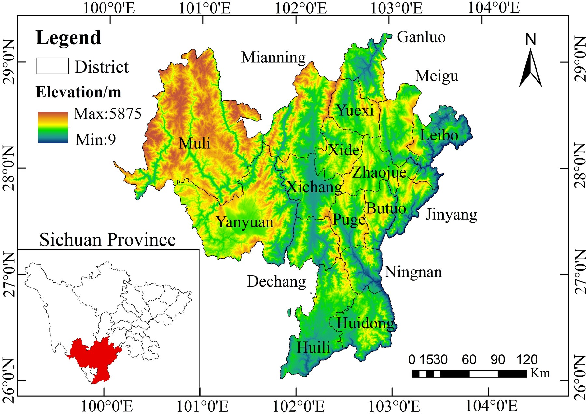
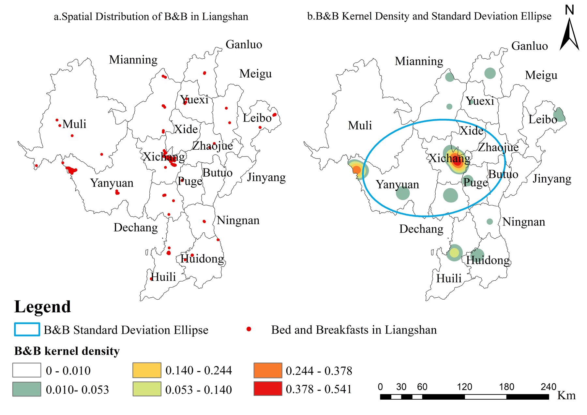
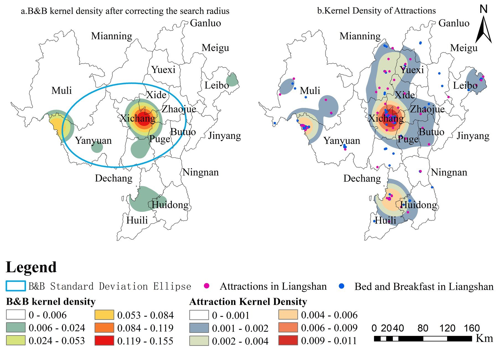
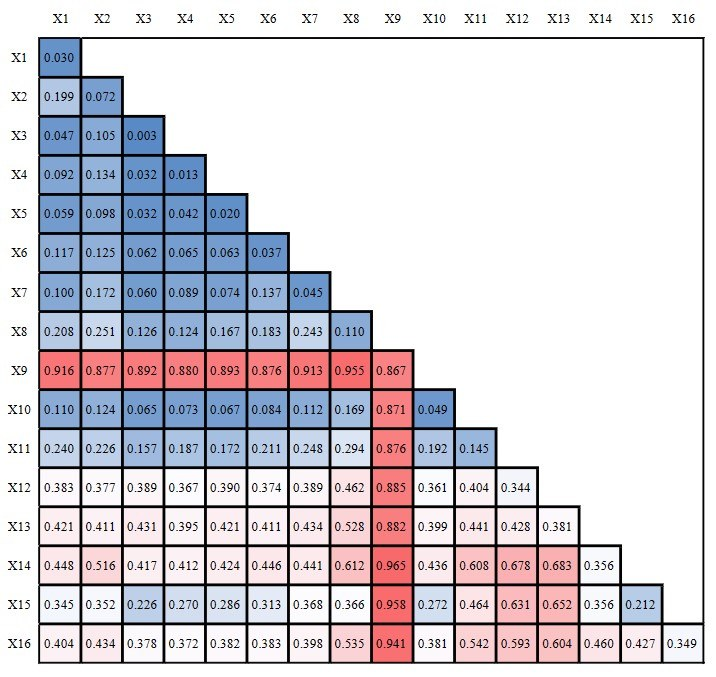
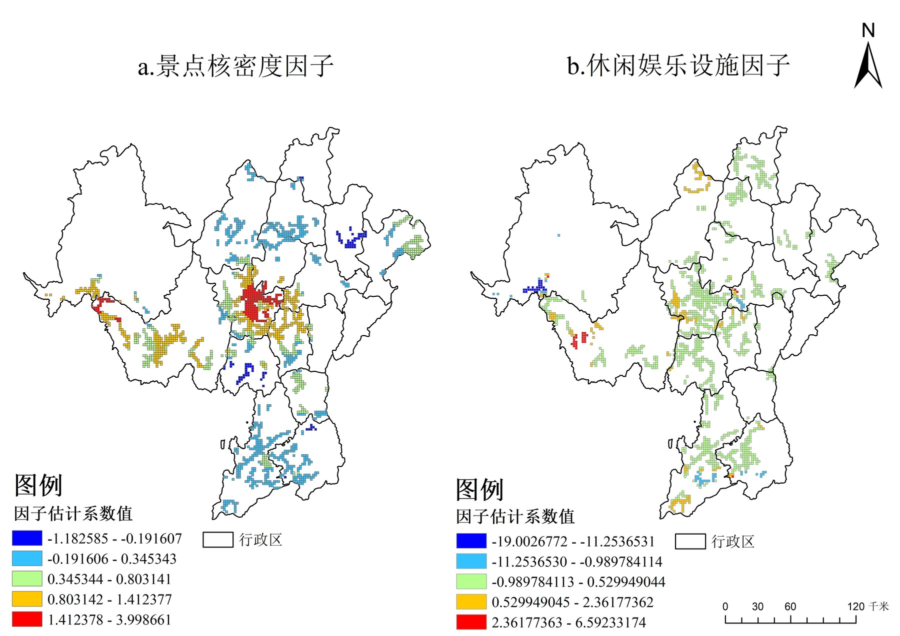
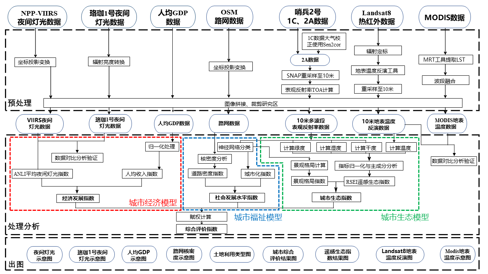
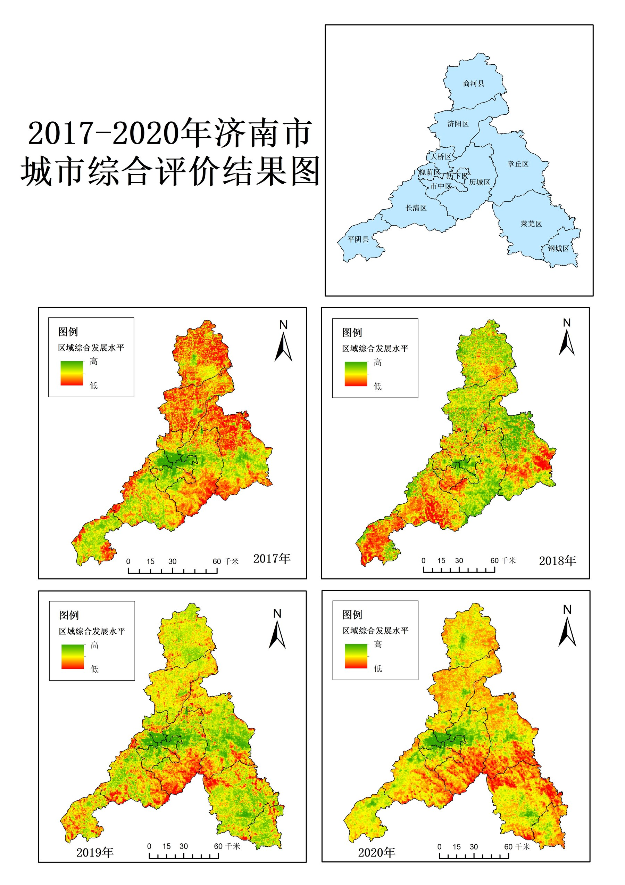
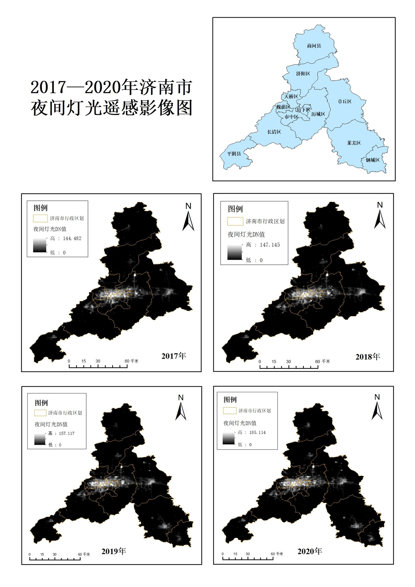
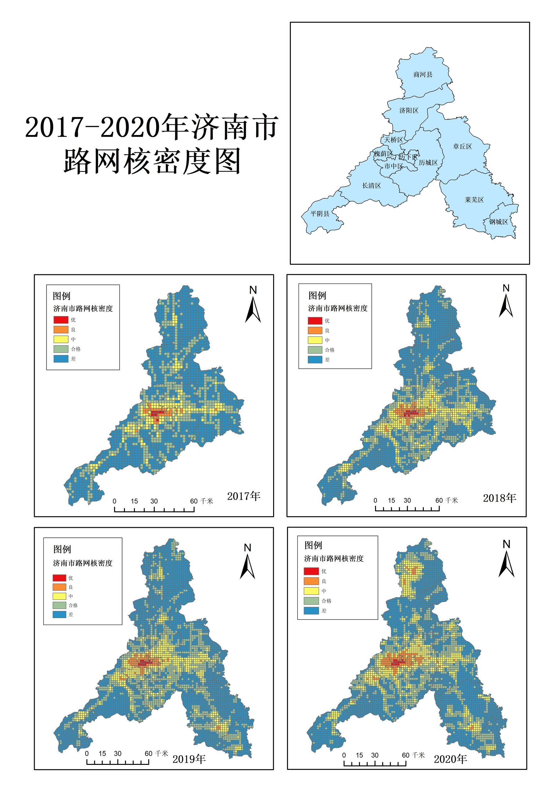
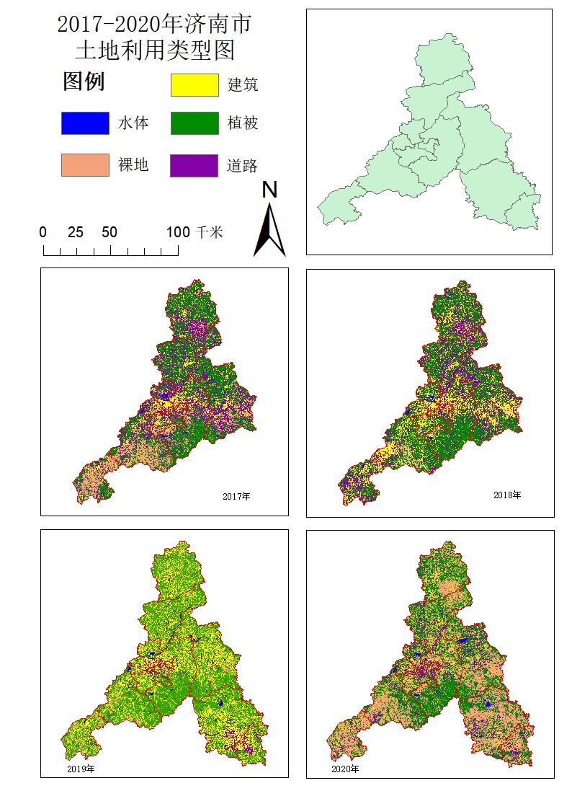

This section presents my earlier GIScience and spatial analysis projects,
highlighting my experience with multi-source geospatial data, spatial
statistics, spatial econometric models, and urban/regional analysis.

::: {.callout-note}
Project details, figures, and contribution statements will be expanded
after additional materials are provided.
:::

## Multiscale Spatial Patterns and Driving Mechanisms of Homestay Development in Liangshan Prefecture

**Keywords:** GIS; Spatial Analysis; Homestays; B&Bs; Liangshan
Prefecture; POI; OSM; NPP-VIIRS; Kernel Density; Average Nearest
Neighbor; Standard Deviational Ellipse; Geographical Detector; GWR;
Spatial Econometrics; Tourism Geography

**Project trajectory:** This work began as my undergraduate thesis,
received undergraduate thesis recognition, was later extended into a
first-author SPIE conference paper, and also supported my B1972 GIS
competition submission.

### Overview

This project investigates the spatial distribution and driving mechanisms
of **homestays / B&Bs in Liangshan Prefecture**, Sichuan, China. It was
initially completed as my **undergraduate thesis** and later developed
into a **first-author SPIE conference paper**. The study integrates
multi-source geospatial data, including **POI records**, remote sensing
imagery, road network data, and statistical data, to characterize
homestay concentration and spatial heterogeneity. Methodologically, it
combines GIS spatial analysis, Average Nearest Neighbor, kernel density
analysis, Standard Deviational Ellipse, **Geographical Detector**, and
**Geographically Weighted Regression (GWR)**. By connecting global-scale
factor detection with local-scale regression modeling, the project
demonstrates my foundation in GIScience, spatial statistics, spatial
econometrics, and multi-source geospatial data analysis for regional
tourism geography.

### Research Objective

- Characterize the spatial distribution pattern of homestays in Liangshan
  Prefecture.
- Identify clustering direction and spatial concentration characteristics
  using GIS-based spatial statistics.
- Quantify global driving factors of homestay distribution using
  Geographical Detector.
- Explore spatially heterogeneous local relationships using GWR.
- Provide a spatial analytical basis for tourism resource planning and
  regional development evaluation.

### Study Area

The study area is Liangshan Yi Autonomous Prefecture in southwestern
Sichuan Province, China, located between 26 degrees 03'--29 degrees 18'
N and 100 degrees 03'--103 degrees 52' E. The prefecture covers
approximately 60,400 km2 and includes 15 counties and 2 county-level
cities. Its terrain is dominated by mountains and plateaus, and its
tourism resources include Qionghai-Lushan, Luoji Mountain, Lugu Lake,
and other major natural and cultural attractions.

### Data

- Homestay / B&B POI data: **369 records** collected for Liangshan
  Prefecture.
- Tourism and service POI data, including attractions, catering,
  shopping, and leisure service facilities.
- OSM road network data, including major road classes used for
  accessibility analysis.
- Remote sensing imagery and nighttime light data used as part of the
  multi-source geospatial data framework.
- Statistical and socioeconomic data used for factor analysis and
  spatial modeling.

### Methods

- Average Nearest Neighbor Index
- Kernel density analysis and modified kernel density analysis
- Standard Deviational Ellipse
- Geographical Detector
- Geographically Weighted Regression, GWR
- Buffer analysis for transportation arteries and tourism attractions
- GIS spatial visualization and mapping
- Global and local scale factor analysis

### Key Results

- The spatial distribution of homestays showed a significant clustering
  pattern, with an Average Nearest Neighbor Index of
  0.141986 and a Z-score of
  -31.573762.
- Standard Deviational Ellipse analysis indicated a
  NE-SW distribution direction,
  with a rotation angle of 81.156
  degrees.
- Kernel density analysis showed a "one main center, one subcenter, and
  multiple points" pattern: Xichang served as the main center, while
  Yanyuan / Lugu Lake formed a subcenter.
- Geographical Detector analysis quantified driving factors at global
  and grid scales, showing that attractions, regional development, and
  population-related factors helped explain homestay distribution.
- GWR-based local analysis showed spatial heterogeneity in the influence
  of key factors. The CA-GWR model achieved an adjusted R2 of
  0.833 and an AICc of
  3451.861.

### My Contribution

- Conceptualized the research topic and developed the overall analytical
  framework for my undergraduate thesis.
- Collected and processed multi-source geospatial datasets, including
  POI, OSM road network, remote sensing, nighttime light, and statistical
  data.
- Independently implemented the spatial analysis and modeling workflow,
  including spatial pattern analysis, Geographical Detector analysis, and
  GWR-based local factor analysis.
- Produced maps, statistical summaries, and result interpretations for
  the thesis and subsequent conference paper.
- Led the writing, revision, and polishing of the undergraduate thesis
  and manuscript, with constructive feedback from my supervisor.

### Outputs and Recognition

- Role: Independent undergraduate thesis
  project; first author of the subsequent SPIE conference paper.
- Undergraduate thesis project, later developed into a first-author SPIE
  conference paper.
- Outstanding Undergraduate Thesis Award.
- Competition project: B1972, *Spatial Distribution and Influencing
  Factors of Homestays in Liangshan Prefecture Based on Geographical
  Detector and Geographically Weighted Regression*.
- Third Prize, Geographic Design Group, 2023 Esri-Cup Chinese College
  Students GIS Software Development Contest, Chinese Society for Geodesy,
  Photogrammetry and Cartography.
- First-author paper: Youbin He; Yanzhen Yang. *Research on the spatial
  distribution and influencing factors of B&Bs in Liangshan prefecture
  based on GIS spatial analysis and spatial econometric model*. ICMIC
  2024, SPIE, Vol. 13447, pp. 1300-1320, 2025.
- DOI: [10.1117/12.3049158](https://doi.org/10.1117/12.3049158).
- Publisher link: [SPIE Digital Library](https://www.spiedigitallibrary.org/conference-proceedings-of-spie/13447/134474P/Research-on-the-spatial-distribution-and-influencing-factors-of-BBs/10.1117/12.3049158.short).
- Public PDF: Not listed because no legally shareable version has been
  confirmed.

### Selected Figures

<figure>
  
  <figcaption>Study area and terrain context of Liangshan Prefecture.</figcaption>
</figure>

  <figure>
    
    <figcaption>Standard Deviational Ellipse and homestay kernel density pattern.</figcaption>
  </figure>
  <figure>
    
    <figcaption>Modified homestay kernel density and attraction kernel density.</figcaption>
  </figure>
  <figure>
    
    <figcaption>Geographical Detector interaction results at the grid scale.</figcaption>
  </figure>
  <figure>
    
    <figcaption>Spatial heterogeneity of key factors from the CA-GWR model.</figcaption>
  </figure>

---

## Integrated Assessment of Urban Development Quality in Jinan City Using Multi-source Geospatial Data

**Keywords:** Urban Development Quality; Multi-source Geospatial Data;
GIS; AHP; Composite Assessment; Spatial Analysis; Jinan City; Remote
Sensing Applications; Urban Planning Support

### Overview

This project evaluated urban development quality in **Jinan City,
Shandong Province, China**, using multi-source geospatial data.
Originally developed as the GIS competition work **D367: Comprehensive
Urban Analysis of Jinan City Based on Multi-source Data**, the project
integrated remote sensing imagery, nighttime light data, road network
data, land-use information, and socioeconomic statistics into an
**AHP-based composite assessment framework**. The assessment considered
economic vitality, ecological quality, and urban welfare / social
development dimensions, classified urban development levels into three
tiers, and produced spatial evaluation maps for **2017–2020**. As an
early team-based GIS and remote sensing application project, it
demonstrates my experience in project leadership, urban spatial
evaluation, multi-source data integration, and GIS-based analytical
communication.

### Research Objective

- Develop a multi-source geospatial framework for evaluating urban
  development quality in Jinan City.
- Construct an assessment structure integrating economic, ecological,
  and social-welfare dimensions.
- Apply AHP and composite assessment thinking to support urban
  development evaluation.
- Classify urban development levels into three tiers for spatial
  comparison.
- Provide GIS-based spatial evidence for urban planning and
  policy-oriented analysis.

### Study Area

The study area is **Jinan City**, Shandong Province, China. The project
focuses on district-level urban development quality and uses multi-year
geospatial and socioeconomic data from 2017 to 2020 to evaluate changes
in urban economy, ecological environment, and social-welfare conditions.

### Data

- Landsat 8 imagery for land surface temperature and ecological
  assessment inputs.
- Sentinel-2 imagery used with Landsat 8 to support RSEI construction.
- MODIS land surface temperature products.
- NPP-VIIRS and Luojia-1 nighttime light data.
- OSM road network data.
- Per-capita GDP data from Jinan statistical yearbook materials.
- Land-use classification data for 2017–2020.

### Indicator System

The project constructed an **AHP-based urban development assessment
framework** organized around three dimensions: urban economy, urban
ecology, and urban welfare / social development. The indicator system
incorporated multi-source geospatial variables related to nighttime light
intensity, economic development, ecological condition, road-network
accessibility, and urbanization / land-use characteristics. These
indicators were integrated to support a spatially explicit assessment of
urban development quality across Jinan City.

Representative indicators included:

- ANLI nighttime light index
- GDPP per-capita GDP index
- Remote Sensing Ecological Index, RSEI
- Road-network kernel density
- Urbanization / land-use related indicators

### Methods

- Multi-source geospatial data preprocessing and spatial alignment.
- Remote sensing index construction and ecological assessment using RSEI.
- Nighttime-light-based economic proxy analysis.
- Road-network kernel density analysis.
- AHP-based weighting and composite assessment modeling.
- GIS raster calculation, zonal statistics, and spatial visualization.
- Three-tier classification of urban development quality.

### Key Results

- Developed an **AHP-based composite assessment framework** integrating
  economic, ecological, and social-welfare dimensions.
- Produced GIS-based urban development quality maps for Jinan City from
  2017–2020.
- Classified urban development quality into three tiers for spatial
  comparison and interpretation.
- Integrated remote sensing products and non-remote-sensing geospatial
  datasets into a unified spatial evaluation workflow.

### My Contribution

- Role: Project Leader.
- Coordinated the overall workflow from research design to final
  competition submission.
- Conceptualized the project topic and developed the analytical
  framework for assessing urban development quality in Jinan City.
- Organized data collection and preprocessing using multi-source
  geospatial datasets.
- Led the construction of the indicator system and the AHP-based
  composite assessment model.
- Implemented GIS-based spatial analysis, mapping, and visualization of
  urban development levels.
- Interpreted the results and led the writing, revision, and refinement
  of the project report and competition materials.
- Coordinated team collaboration and ensured completion of the project
  deliverables.

### Outputs and Recognition

- GIS competition project: D367, *Comprehensive Urban Analysis of Jinan
  City Based on Multi-source Data*.
- Third Prize, Remote Sensing Application Group, 2022 Esri-Cup Chinese
  College Students GIS Software Development Contest, Chinese Society for
  Geodesy, Photogrammetry and Cartography.
- First Prize, 2nd Remote Sensing Technology Competition, Shandong
  Jiaotong University.

### Selected Figures

<figure>
  
  <figcaption>Analytical workflow integrating nighttime lights, GDP, OSM roads, Sentinel-2, Landsat 8, MODIS, and GIS-based composite assessment.</figcaption>
</figure>

  <figure>
    
    <figcaption>Composite urban development assessment results for Jinan City.</figcaption>
  </figure>
  <figure>
    
    <figcaption>Nighttime-light evidence used as an economic development proxy.</figcaption>
  </figure>
  <figure>
    
    <figcaption>Road-network kernel density used in the social-welfare / accessibility dimension.</figcaption>
  </figure>
  <figure>
    
    <figcaption>Land-use classification outputs for 2017–2020.</figcaption>
  </figure>

