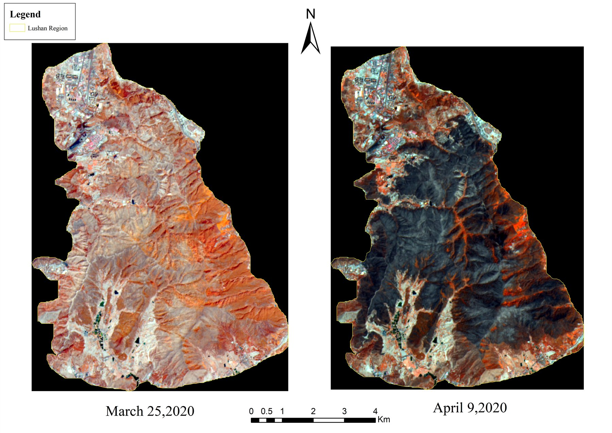
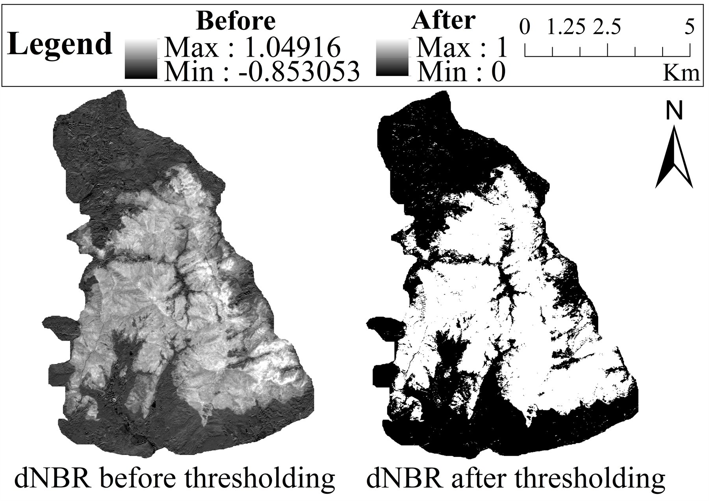
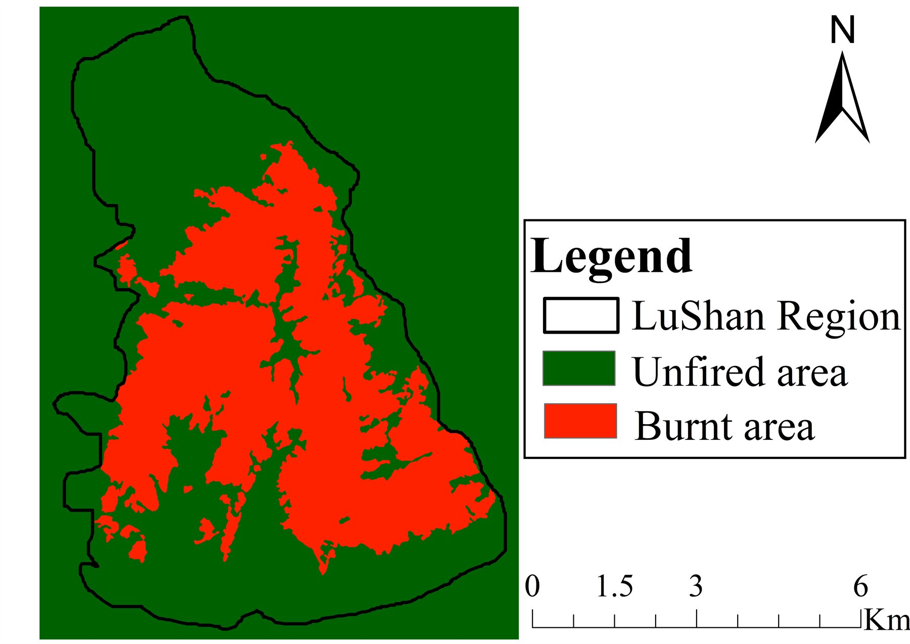
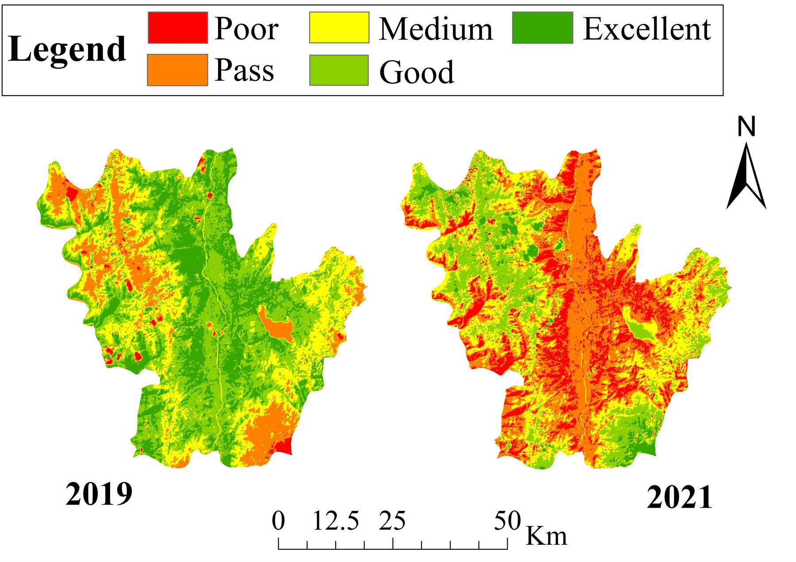
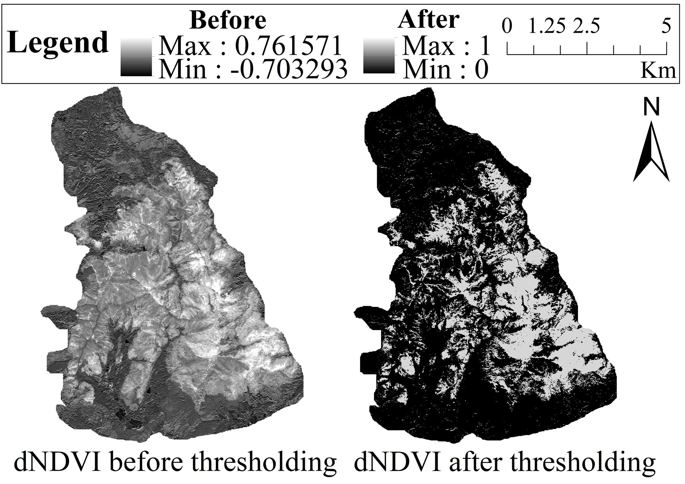
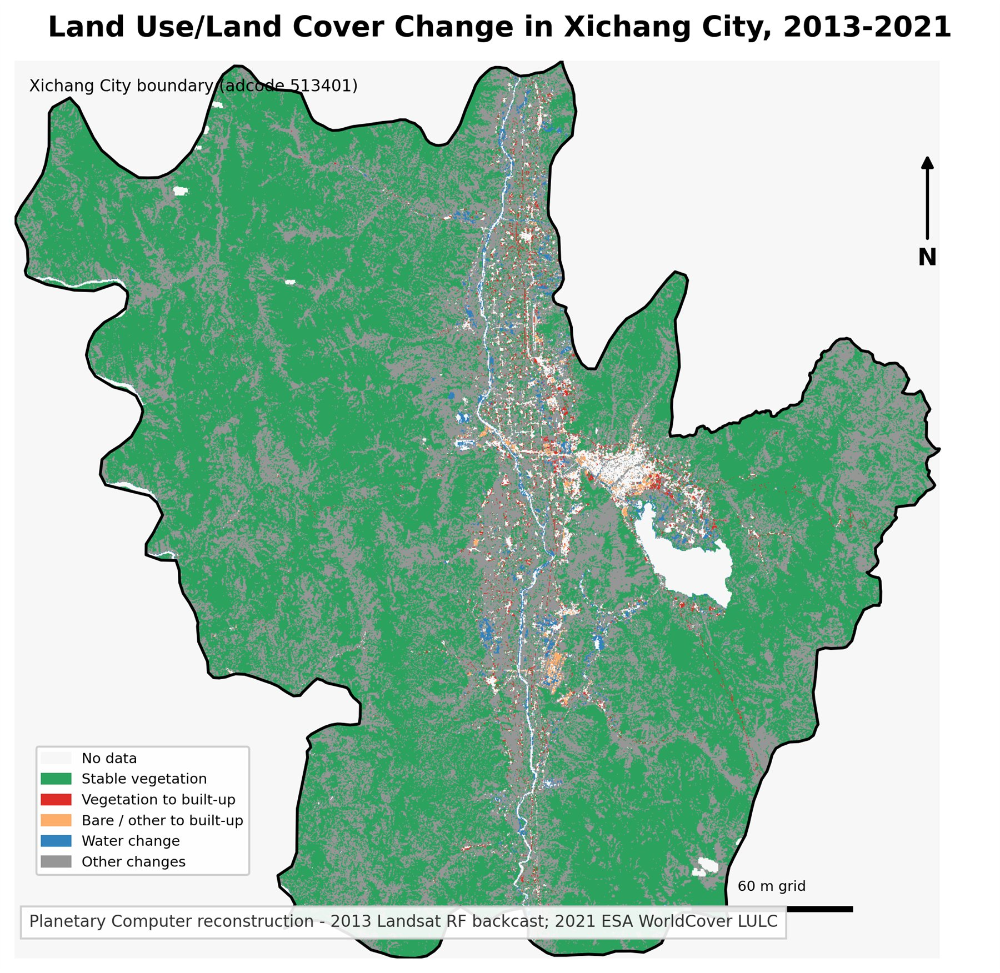
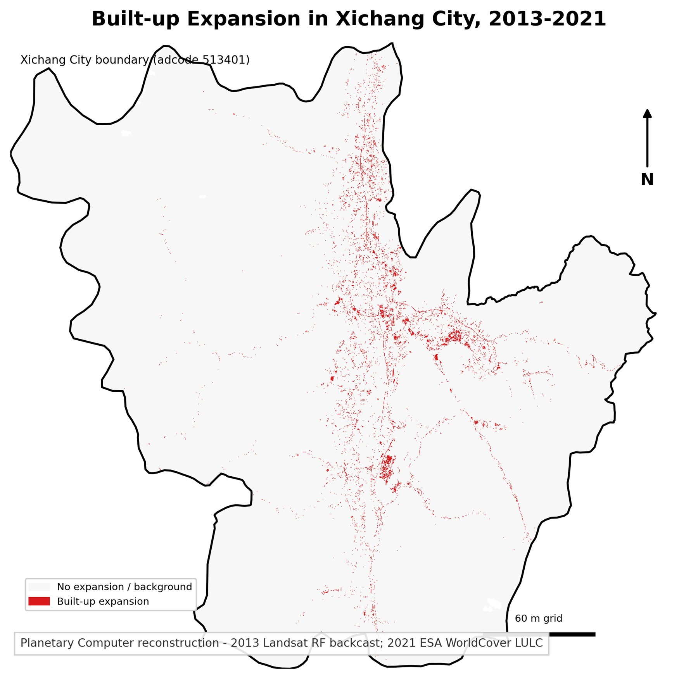
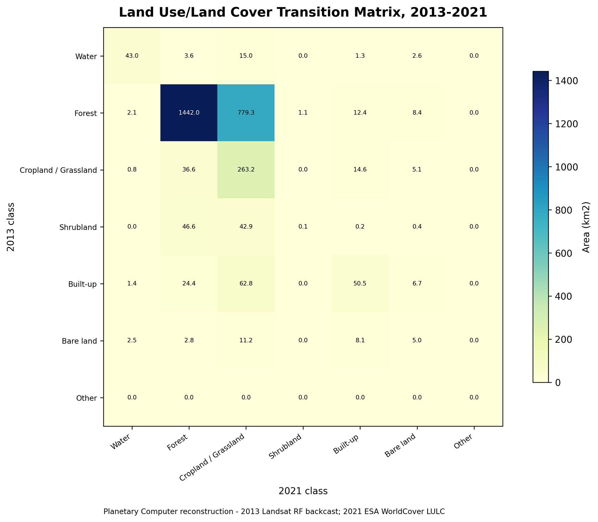
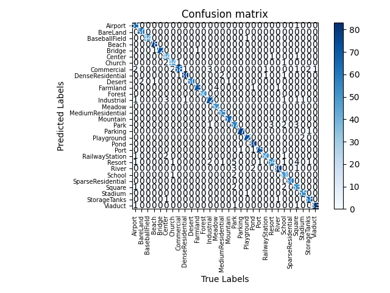

---
title: "Featured Research"
editor:
  markdown:
    wrap: 72
---

This section highlights my research interests and project experience in
**GeoAI**, **AI for Remote Sensing**, wildfire risk modeling, ecological
remote sensing, and remote sensing image interpretation.

::: {.callout-note}
Figures and detailed contribution statements will be added later.
:::

## Wildfire Risk Modeling in Southwest China

**Keywords:** Wildfire Risk Modeling; GeoAI; AI for Remote Sensing;
Spatial Machine Learning; XGBoost; SHAP; GeoShapley; Multi-scale
Geospatial Analysis; Ecological Remote Sensing

**Status:** Manuscript under review / manuscript in preparation

**Overview**  
This research direction focuses on the spatiotemporal driving mechanisms
of grassland and forest fires in Southwest China. It integrates
multi-source remote sensing and geospatial data with machine learning and
explainable AI methods to examine wildfire risk, spatial heterogeneity,
and interpretable environmental drivers. The project is positioned at
the intersection of GeoAI, AI for Remote Sensing, ecological remote
sensing, and wildfire risk modeling. Specific results will be added only
after the manuscript materials are updated.

**Research Questions**

- [To be added]

**Study Area and Period**

- [To be added]

**Data Sources**

- [To be added]

**Methods**

- [To be added]

**Key Findings**

- [To be added after manuscript update]

**My Contribution**

[To be added by Youbin]

**Figures / Materials to be Added**

- [Add study area map]
- [Add data and workflow diagram]
- [Add model performance comparison]
- [Add SHAP / GeoShapley interpretation figures]
- [Add spatial prediction or risk map]

---

## Multi-source Remote Sensing Assessment of Wildfire Disturbance and Post-fire Ecological Dynamics in Xichang City

**Keywords:** Ecological Remote Sensing; Wildfire Disturbance; Landsat
8; Sentinel-2; dNBR; RSEI; Burned Area Mapping; Land-use / Land-cover
Change; Post-fire Ecological Assessment; Xichang City

### Overview

This umbrella project evaluates wildfire disturbance and post-fire
ecological dynamics in Xichang City, Sichuan Province, using
multi-source remote sensing and
GIS-based spatial analysis. As Project
Leader, I coordinated a workflow that connected forest fire
monitoring, dNBR burned-area
mapping, land-use / land-cover change analysis, and
RSEI ecological assessment. The
project integrated Landsat 8 and Sentinel-2 imagery to quantify burned
area, evaluate ecological disturbance, and visualize landscape changes
before and after the 2020 Lushan forest fire. It led to a first-author
SPIE conference paper on land dynamic changes, a co-authored SPIE
conference paper on forest fire monitoring, and a First Prize in the
1st Remote Sensing Technology Competition at Shandong Jiaotong
University. The work demonstrates my experience in ecological remote
sensing, satellite image preprocessing, thematic mapping, and organizing
collaborative research outputs.

### Subproject A: Forest Fire Monitoring and Burned Area Mapping in Xichang City

#### Objective

- Detect and map burned areas caused by forest fire disturbance.
- Compare remote-sensing-derived burned area with a field survey
  reference.
- Support post-fire ecological impact assessment using satellite
  imagery and GIS mapping.

#### Data

- Sentinel-2 imagery
- Landsat 8 imagery
- Field survey reference burned area for validation

#### Methods

- dNBR-based burned-area extraction
- Pre-fire and post-fire remote sensing image comparison
- GIS-based burned area mapping
- Area statistics and comparison with field survey reference
- RSEI-based ecological environment assessment

#### Key Results

- Estimated approximately 825 ha of
  burned area.
- The estimate was within 4% of
  the 791.6 ha field survey
  reference.
- Generated burned-area maps and fire monitoring thematic outputs for
  the Lushan fire area.
- RSEI analysis indicated that "excellent" ecological zones declined by
  38.2%.
- Vegetation cover dropped by
  3.3% after fire disturbance.

### Subproject B: Land-use / Land-cover Change and RSEI-based Post-fire Ecological Assessment

#### Objective

- Classify land-use / land-cover patterns in Xichang City.
- Analyze land-use changes before and after wildfire disturbance.
- Assess post-fire ecological changes using RSEI.
- Visualize built-up expansion and land-use transition patterns.

#### Data

- Landsat 8 time-series imagery
- Sentinel-2 imagery for wildfire-related analysis
- Reconstructed public-data LULC visualizations for portfolio display

#### Methods

- Supervised classification for five land-use categories
- Land-use / land-cover change analysis
- Built-up area expansion analysis
- RSEI-based ecological assessment
- Transition matrix and land-use transfer visualization for the
  reconstructed portfolio outputs
- GIS thematic mapping

#### Key Results

- Classified five land-use categories using preprocessed Landsat 8
  time-series imagery.
- Quantified 103.5 km² expansion
  of built-up areas in the original project analysis.
- Identified a 38.2% decline in
  "excellent" ecological zones and a
  3.3% drop in overall vegetation
  cover.
- Reconstructed portfolio figures provide public-data visualizations of
  LULC change, built-up expansion, and transition-matrix patterns for
  2013-2021.

### My Contribution

- **Role:** Project Leader
- Conceptualized the research topic and developed the analytical
  framework for wildfire monitoring, land-use change analysis, and
  post-fire ecological assessment in Xichang City.
- Organized data collection and preprocessing using multi-source remote
  sensing datasets.
- Led the implementation of land-use / land-cover classification,
  burned-area mapping, RSEI-based ecological assessment, and GIS-based
  spatial analysis.
- Produced thematic maps, statistical summaries, and result
  interpretations for the project and subsequent conference papers.
- Led project reporting and manuscript refinement while coordinating
  collaboration among team members.

### Outputs and Recognition

- First Prize, 1st Remote Sensing Technology Competition, Shandong
  Jiaotong University.
- First-author conference paper: Youbin He and Xiaolei Ju. *XiChang
  City land dynamic changes based on the remote sensing data*. ICGMRS
  2023, SPIE Vol. 12978, 2023. DOI:
  [10.1117/12.3020749](https://doi.org/10.1117/12.3020749).
- Co-author conference paper: Rui Wang, Youbin He, Songyan Li, and
  Rubing Huang. *Forest fire monitoring based on the remote sensing
  technology*. ICGMRS 2024, SPIE Vol. 13223, 2024.

### Selected Figures

{fig-alt="False-color remote sensing comparison before and after the 2020 Lushan forest fire in Xichang City." fig-align="center"}

Pre-fire and post-fire false-color imagery showing the spatial footprint
of the Lushan forest fire disturbance.

::: {.columns}
::: {.column width="50%"}
{fig-alt="dNBR before and after thresholding for burned-area extraction in the Lushan fire area."}

dNBR thresholding used for burned-area extraction.
:::

::: {.column width="50%"}
{fig-alt="Burned and unburned area classification map for the Lushan region in Xichang City."}

Burned-area classification map for the Lushan region.
:::
:::

::: {.columns}
::: {.column width="50%"}
{fig-alt="RSEI ecological grade maps comparing 2019 and 2021 conditions in Xichang City."}

RSEI-based ecological assessment before and after disturbance.
:::

::: {.column width="50%"}
{fig-alt="dNDVI before and after thresholding for vegetation disturbance analysis."}

dNDVI thresholding used to support vegetation disturbance analysis.
:::
:::

::: {.columns}
::: {.column width="50%"}
{fig-alt="Reconstructed land-use and land-cover change visualization for Xichang City from 2013 to 2021."}

Reconstructed LULC change map generated for portfolio visualization.
:::

::: {.column width="50%"}
{fig-alt="Reconstructed built-up expansion visualization for Xichang City from 2013 to 2021."}

Reconstructed built-up expansion visualization for portfolio display.
:::
:::

{fig-alt="Reconstructed land-use and land-cover transition matrix for Xichang City from 2013 to 2021." fig-align="center"}

Reconstructed LULC transition matrix generated for portfolio
visualization. These reconstructed figures are public-data
visualizations and should not be interpreted as original published paper
figures.

---

## Attention-Enhanced Deep Learning for Remote Sensing Scene Classification

**Keywords:** AI for Remote Sensing; Deep Learning; Remote Sensing Scene
Classification; Efficient Channel Attention; ECA-ResNet34; ResNet-34;
AID Dataset; PyTorch

### Overview

This project addresses remote sensing image scene classification using an
attention-enhanced convolutional neural network. The specific model,
**ECA-ResNet34**, integrates Efficient Channel Attention blocks into
ResNet-34 residual modules to strengthen channel-wise feature
representation while preserving the residual learning structure. The
model was validated on the AID dataset and demonstrates my foundational
experience in AI for Remote Sensing, deep-learning experiment design, and
intelligent interpretation of remote sensing imagery.

### Research Objective

- Improve remote sensing scene classification using an
  attention-enhanced CNN architecture.
- Integrate lightweight channel attention into ResNet-34 while
  preserving the residual learning structure.
- Evaluate the proposed ECA-ResNet34 model on the AID dataset.

### Dataset

- AID dataset: a 30-category aerial image scene dataset with 10,000
  images collected from Google Earth.
- Each category contains 200-400 images with a 600 x 600 pixel size.
- The available project materials use a random 8:2 training /
  validation split.

### Method

- Baseline: ResNet-34
- Attention mechanism: Efficient Channel Attention, ECA
- Proposed model: ECA-ResNet34
- Task: Remote sensing scene classification
- Experimental setup: Adam optimizer, initial learning rate of 0.0001,
  batch size of 16, 100 epochs for training without pre-trained weights,
  and 10 epochs for tests with pre-trained weights.
- Evaluation: overall accuracy, confusion matrix, and class-level
  precision.

### Key Results

- Achieved 94.95% classification
  accuracy on the AID dataset.
- Improved accuracy by 3.45 percentage
  points compared with standard ResNet-34.
- The available paper draft reports that the identity variant of
  ECA-ResNet34 achieved the best non-pre-trained result among the tested
  ECA block placements.
- The confusion matrix and class-level evaluation indicate strong
  recognition performance for several scene categories, including
  BareLand, Beach, Forest, Mountain, and SparseResidential.

### My Contribution

- Participated in data collection and research design.
- Contributed to the formulation of the research idea and experimental
  workflow.
- Independently implemented the experimental component, including model
  configuration, training, evaluation, and result analysis.
- Assisted in drafting, revising, and polishing the manuscript.

### Outputs

- Role: Co-first author / core
  contributor
- IEEE conference paper: *Remote Sensing Image Scene
  Classification Based on ECA Attention Mechanism Convolutional Neural
  Network*.
- Publisher link: [IEEE Xplore](https://ieeexplore.ieee.org/abstract/document/9987089)
- PDF: Available upon reasonable request, subject to publisher sharing
  policy.

### Selected Figure

{fig-alt="Confusion matrix showing ECA-ResNet34 scene classification results on the AID dataset." fig-align="center"}

Confusion matrix for the ECA-ResNet34 identity variant on the AID
dataset. Additional architecture diagrams and training-curve figures will
be added only after web-ready, publicly shareable versions are verified.
