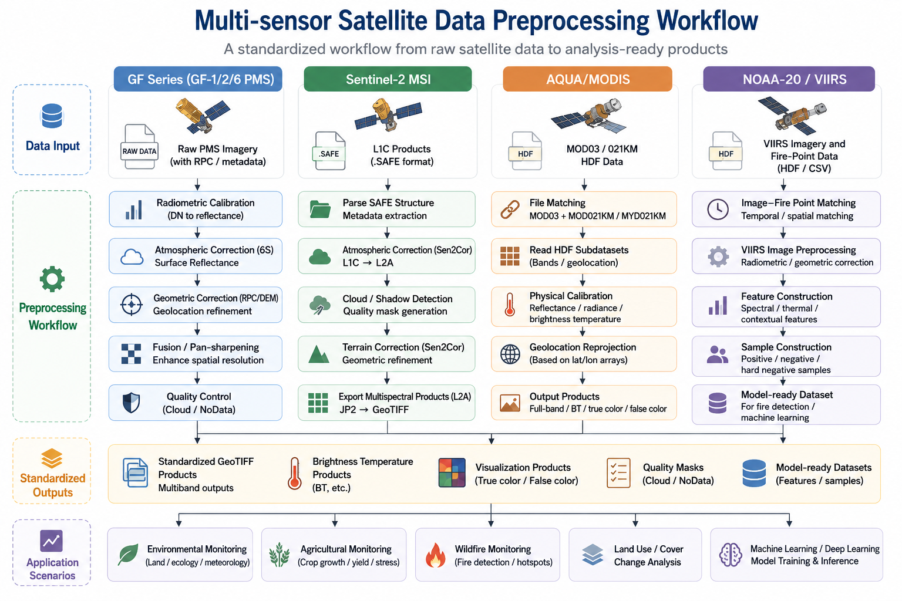

From Raw Satellite Data to Analysis-ready Remote Sensing Products

This page summarizes my professional experience in developing **multi-sensor satellite preprocessing workflows** for operational remote sensing applications. These projects cover multiple satellite data sources, including **GF-series PMS imagery**, **Sentinel-2 MSI**, **AQUA/MODIS**, and **NOAA-20/VIIRS-related fire detection data preparation**.

My work in this direction focuses on transforming raw or semi-processed satellite data into **analysis-ready GeoTIFF products**, supporting downstream applications such as **wildfire monitoring**, **agricultural monitoring**, **land surface condition analysis**, **thematic mapping**, and **machine-learning-based fire detection**.

These preprocessing projects form the engineering foundation for my later work in operational remote sensing systems, wildfire detection, crop growth assessment, and explainable GeoAI research.

Due to confidentiality requirements, detailed code, non-public datasets, private implementation details, non-public operational information, and operational product examples are not publicly displayed. The descriptions below summarize generalized technical workflows and my personal contributions.

::: {.workflow-figure-card}

Generic workflow diagram for multi-sensor satellite data preprocessing, from raw inputs to standardized outputs and application scenarios.

:::

---

## Overview of Satellite Preprocessing Workflows

Across different projects, I developed or contributed to workflows involving:

* **Radiometric calibration**
* **Atmospheric correction**
* **Geometric correction and reprojection**
* **HDF and SAFE data parsing**
* **RPC-based correction**
* **Brightness temperature retrieval**
* **Cloud and quality control**
* **Pan-sharpening**
* **True-color and false-color visualization**
* **Batch processing and deployment-side preparation**
* **GeoTIFF product generation**
* **Fire-monitoring and machine-learning data preparation**

Representative technologies:

::: {.tech-tags}
Python
GDAL
rasterio
NumPy
pyhdf
Py6S
Sen2Cor
QGIS
GeoTIFF
HDF
SAFE
RPC
VIIRS
MODIS
:::

---

## 1. GF-Series PMS Preprocessing

### Project Summary

This project focused on developing a reusable preprocessing workflow for **GF-1, GF-2, and GF-6 PMS imagery**. The goal was to build an automated Python-based processing pipeline for high-resolution optical satellite imagery, supporting standardized preprocessing for downstream remote sensing applications.

### Technical Workflow

The workflow included:

* **Radiometric calibration** using sensor-specific gain and offset coefficients
* **6S-based atmospheric correction** for multispectral imagery
* **RPC-based geometric correction** using satellite rational polynomial coefficients
* **DEM-assisted correction** where applicable
* **Pan-sharpening** by fusing high-resolution panchromatic imagery with multispectral bands
* **GeoTIFF product generation**
* **Sensor parameter management** through configuration files

### My Contributions

I was responsible for the technical research, workflow design, Python implementation, sample testing, documentation, and deployment-side preparation of the GF-series preprocessing pipeline.

My work included:

* Designing a modular preprocessing workflow for **GF-1 / GF-2 / GF-6 PMS data**
* Implementing radiometric calibration for panchromatic and multispectral imagery
* Integrating **6S atmospheric correction** into the processing chain
* Applying **RPC-based geometric correction**
* Implementing pan-sharpening for high-resolution product generation
* Writing technical documentation and algorithm descriptions
* Deploying the workflow as a reusable local preprocessing tool

### Skills Demonstrated

::: {.tech-tags}
GF-series
PMS imagery
Radiometric Calibration
6S Atmospheric Correction
RPC Correction
Pan-sharpening
Python
GDAL
rasterio
:::

---

## 2. Sentinel-2 Preprocessing

### Project Summary

This project focused on developing an automated preprocessing workflow for **Sentinel-2 MSI imagery**. The workflow combined **Python scripting** with **Sen2Cor** to support batch processing of Sentinel-2 Level-1C products and generate analysis-ready Level-2A surface reflectance products.

### Technical Workflow

The workflow included:

* Batch scanning of Sentinel-2 `.SAFE` product directories
* Automated execution of **Sen2Cor**
* **L1C-to-L2A atmospheric correction**
* Cloud and cloud-shadow detection
* Terrain correction supported by Sen2Cor
* Extraction and organization of L2A products
* JP2 to GeoTIFF conversion
* Output folder organization and standardized file management

### My Contributions

I independently designed and developed the Sentinel-2 preprocessing workflow, including environment configuration, automated processing logic, product organization, representative scene testing, documentation, and deployment-side preparation.

My work included:

* Building a Python wrapper for Sentinel-2 preprocessing
* Configuring and integrating **Sen2Cor**
* Automating batch processing of Sentinel-2 `.SAFE` products
* Organizing L2A outputs into analysis-ready raster products
* Reducing manual preprocessing steps for operational use
* Preparing technical documentation for reproducible preprocessing

### Skills Demonstrated

::: {.tech-tags}
Sentinel-2
MSI
Sen2Cor
L1C-to-L2A
Surface Reflectance
Cloud Detection
GeoTIFF Conversion
Batch Processing
:::

---

## 3. AQUA/MODIS Preprocessing for Fire Monitoring

### Project Summary

This project focused on developing an automated preprocessing workflow for **AQUA/MODIS HDF data** to support fire hotspot interpretation and wildfire-related monitoring. The goal was to convert locally acquired daily satellite data into georeferenced products suitable for visual interpretation of potential high-temperature anomalies.

### Technical Workflow

The workflow included:

* Searching and filtering **MOD03 geolocation files**
* Parsing filenames to extract platform, date, time, and orbit information
* Matching geolocation files with **MOD021KM / MYD021KM science data**
* Reading MODIS HDF subdatasets, including:

  * 250 m reflective solar bands aggregated to 1 km
  * 500 m reflective solar bands aggregated to 1 km
  * 1 km reflective solar bands
  * 1 km thermal emissive bands
* Converting raw DN values into:

  * **TOA reflectance**
  * **Spectral radiance**
  * **Brightness temperature**
* Reprojecting swath data using MOD03 latitude and longitude arrays
* Generating EPSG:4326 GeoTIFF products
* Producing **RGB true-color** and **MNR false-color** products for fire hotspot interpretation

### My Contributions

I was mainly responsible for the AQUA/MODIS preprocessing module, including HDF data parsing, physical calibration, geolocation-based reprojection, visualization product generation, and local batch deployment.

My work included:

* Implementing automatic MOD03 and MOD021KM/MYD021KM file matching
* Parsing MODIS HDF subdatasets and calibration attributes
* Implementing reflectance calibration for reflective solar bands
* Implementing radiance calibration and brightness temperature retrieval for thermal emissive bands
* Developing geolocation-array-based reprojection methods
* Generating full-band GeoTIFF, RGB true-color, and MNR false-color products
* Preparing technical documentation for team reuse

This project strengthened my understanding of MODIS HDF structures, swath geolocation, thermal infrared calibration, and fire-monitoring visualization products.

### Skills Demonstrated

::: {.tech-tags}
AQUA
MODIS
HDF
MOD03
MOD021KM
MYD021KM
Brightness Temperature
Geolocation Array
GDAL Warp
Fire Monitoring
:::

---

## 4. NOAA-20 / VIIRS Fire Detection Data Preparation In progress

### Project Summary

This ongoing work focuses on preparing **NOAA-20 / VIIRS imagery and fire-point records** for machine-learning-based fire detection. Compared with the previous preprocessing projects, this workflow is more directly connected to **fire detection modeling**, **positive and negative sample construction**, and **feature engineering**.

### Technical Workflow

The workflow includes:

* Matching fire-point records with NOAA-20 / VIIRS image acquisition time
* Converting local observation time to UTC when required
* Downloading and organizing satellite granules
* Preprocessing VIIRS imagery into model-ready raster inputs
* Extracting spectral and contextual features
* Constructing positive fire samples from verified fire points
* Constructing negative samples from background and hard negative regions
* Designing candidate features for machine-learning-based fire detection

Candidate features include:

* Reflectance bands
* Brightness temperature bands
* Thermal band differences
* Neighborhood mean and standard deviation
* Day/night information
* Seasonal features such as day-of-year sine and cosine
* Contextual information from surrounding pixels

### My Contributions

My work in this direction focuses on developing the preprocessing and sample-generation pipeline for polar-orbiting satellite fire detection. This includes time matching, raster preprocessing, positive/negative sample construction, contextual feature extraction, and preparing model-ready datasets.

This project is still being improved and will be further connected with machine learning models for operational fire detection.

### Skills Demonstrated

::: {.tech-tags}
NOAA-20
VIIRS
Fire Detection
Sample Construction
Feature Engineering
Brightness Temperature
Hard Negative Samples
Machine Learning Preparation
:::

---

## Cross-sensor Engineering Capabilities

These preprocessing projects helped me develop a reusable engineering mindset for handling different satellite products and sensor-specific requirements.

### Data Format Adaptation

Different sensors use different product structures and file formats:

* GF-series imagery often requires metadata parsing, RPC correction, and pan-sharpening.
* Sentinel-2 products are organized as `.SAFE` directories and require L1C-to-L2A processing.
* MODIS data are stored in HDF format with multiple subdatasets and geolocation files.
* VIIRS workflows require time matching, granule organization, and model-ready feature extraction.

### Physical and Geometric Preprocessing

Across projects, I worked with:

* Radiometric calibration
* Atmospheric correction
* Reflectance conversion
* Radiance calibration
* Brightness temperature retrieval
* Geometric correction
* RPC correction
* Swath geolocation reprojection
* DEM-assisted processing

### Automation and Deployment

A key part of my work was to turn preprocessing logic into reusable and operational workflows. This included:

* Batch file scanning
* Parameter configuration
* Automated file organization
* Standardized naming rules
* GeoTIFF output generation
* Deployment-side preparation
* Technical documentation
* Integration with downstream analysis workflows

---

## Outputs and Applications

The preprocessing workflows generated or supported the following types of outputs:

* Analysis-ready GeoTIFF products
* Surface reflectance products
* Geometrically corrected imagery
* Pan-sharpened high-resolution imagery
* Brightness temperature products
* Full-band MODIS products
* RGB true-color images
* False-color fire-monitoring products
* Model-ready VIIRS fire-detection samples
* Technical documentation and reusable processing templates

These outputs supported applications including:

* Fire hotspot interpretation
* Wildfire monitoring
* Agricultural monitoring
* Environmental condition assessment
* Operational product generation
* Thematic mapping
* Machine-learning-based fire detection

---

## Technical Skills Highlight

### Remote Sensing

* Multi-sensor satellite preprocessing
* Radiometric calibration
* Atmospheric correction
* TOA reflectance conversion
* Brightness temperature retrieval
* Pan-sharpening
* Cloud and quality control
* Fire-monitoring visualization

### Geospatial Processing

* Raster reprojection
* Swath geolocation
* RPC-based correction
* GeoTIFF generation
* Spatial metadata handling
* Batch raster processing
* DEM-assisted correction

### Programming and Engineering

* Python workflow development
* GDAL and rasterio processing
* HDF parsing with pyhdf
* Sen2Cor integration
* Py6S-based correction
* Automated file matching
* Batch processing scripts
* Technical documentation

---

## Professional Growth

These satellite preprocessing projects were important steps in my transition from general remote sensing data processing to more advanced operational remote sensing engineering. They helped me understand how different satellite systems store data, how physical quantities are derived from raw observations, and how preprocessing choices affect downstream interpretation, product generation, and machine-learning workflows.

The experience also provided a technical bridge between operational engineering projects and my research interests in wildfire monitoring, remote sensing data fusion, and GeoAI.

---

## Confidentiality Statement

Most projects summarized on this page were conducted in professional or applied operational contexts. Therefore, detailed code, non-public datasets, non-public operational information, private implementation details, and operational product examples are not publicly displayed.

The purpose of this page is to summarize generalized technical workflows, satellite preprocessing experience, and my personal contributions without exposing confidential materials.
